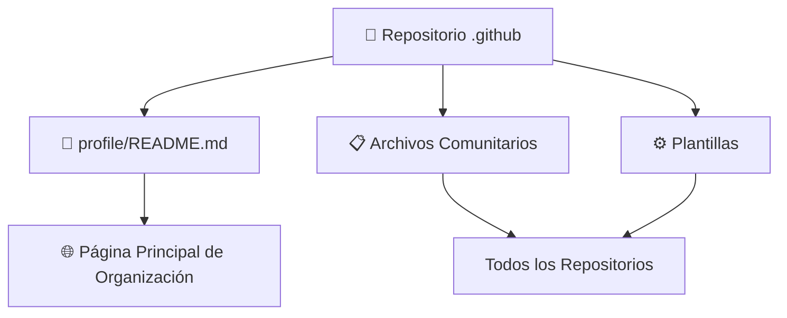
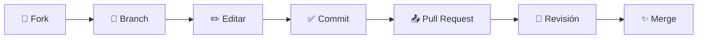

<div align="center">

<!-- Header Banner -->


# 📂 Repositorio .github

### 🏢 **Documentación y Configuración de la Organización Cátedra MANEDS**

<br>

[](https://github.com/Catedra-MANEDS)
[](https://github.com/orgs/Catedra-MANEDS/repositories)
[](./profile/README.md)

<br>

### 💡 *Configuración central y archivos de salud comunitaria para toda la organización*

---

</div>

## 📋 Tabla de Contenidos

- [🎯 Acerca de Este Repositorio](#-acerca-de-este-repositorio)
- [👥 Perfil de la Organización](#-perfil-de-la-organización)
- [📁 Estructura del Repositorio](#-estructura-del-repositorio)
- [🔧 Archivos de Salud Comunitaria](#-archivos-de-salud-comunitaria)
- [🤝 Contribuyendo](#-contribuyendo)
- [📖 Recursos Adicionales](#-recursos-adicionales)

## 🎯 Acerca de Este Repositorio

Este es el repositorio especial `.github` para la organización **Cátedra MANEDS**. GitHub utiliza automáticamente este repositorio para:

<table>
<tr>
<td width="33%" align="center">

<br><strong>Perfil de Organización</strong>
<br><sub>Mostrar información del perfil en la página principal de la organización</sub>
</td>
<td width="33%" align="center">

<br><strong>Archivos Comunitarios</strong>
<br><sub>Almacenar archivos de salud comunitaria predeterminados (CODE_OF_CONDUCT, CONTRIBUTING, etc.)</sub>
</td>
<td width="33%" align="center">

<br><strong>Configuraciones</strong>
<br><sub>Configurar ajustes y plantillas predeterminadas de repositorios</sub>
</td>
</tr>
</table>

### ✨ Características Principales

- 🏠 **Perfil Público**: README visible en la página principal de la organización
- 📄 **Plantillas Predeterminadas**: Issues y Pull Requests templates compartidos
- 🔒 **Políticas de Seguridad**: Directrices de seguridad para todos los repositorios
- 🤝 **Guías de Contribución**: Estándares unificados para contribuidores
- ⚙️ **Workflows de GitHub Actions**: Automatizaciones compartidas

## 👥 Perfil de la Organización

<div align="center">



</div>

El README del perfil de la organización se encuentra en [`profile/README.md`](./profile/README.md) y se muestra en la página principal de la organización. Contiene:

<table>
<tr>
<td width="50%">

### 📖 **Contenido del Perfil:**
- ✨ Introducción y misión de la organización
- 🏷️ Convenciones de nombres de repositorios
- 📊 Áreas de enfoque y tecnologías
- 🤝 Consideraciones generales para contribuidores
- 🔗 Enlaces a recursos importantes
- 📚 Guías de mejores prácticas

</td>
<td width="50%">

### 🎨 **Elementos Visuales:**
- 🎨 Banner animado
- 🏷️ Badges informativos
- 📊 Tablas organizadas
- 🔄 Diagramas Mermaid
- 🎯 Iconos y emojis descriptivos
- 🌈 Formato profesional

</td>
</tr>
</table>

## 📁 Estructura del Repositorio

```
📦 .github/
│
├── 📄 README.md              # Este archivo - Documentación del repositorio
│
└── 📂 profile/
    └── 📄 README.md          # Perfil de organización (visible públicamente en GitHub)
│
├── 📂 ISSUE_TEMPLATE/        # (Futuro) Plantillas de issues
├── 📂 PULL_REQUEST_TEMPLATE/ # (Futuro) Plantillas de pull requests
├── 📂 workflows/             # (Futuro) GitHub Actions compartidos
└── 📄 CONTRIBUTING.md        # (Futuro) Guía de contribución global
```

### 📂 Archivos Actuales

| Archivo | Propósito | Audiencia |
|---------|-----------|-----------|
| `README.md` | Documentación del repositorio `.github` | Mantenedores y contribuidores |
| `profile/README.md` | Perfil público de la organización | Todo el público visitante |

## 🔧 Archivos de Salud Comunitaria

Los archivos de salud comunitaria en este repositorio se aplican como predeterminados a **todos los repositorios** de la organización que no tengan sus propios archivos.

### 🎯 Archivos Soportados:

- `CODE_OF_CONDUCT.md` - Código de conducta
- `CONTRIBUTING.md` - Guía de contribución
- `FUNDING.yml` - Información de patrocinio
- `GOVERNANCE.md` - Modelo de gobernanza
- `SECURITY.md` - Política de seguridad
- `SUPPORT.md` - Recursos de soporte

> 💡 **Nota**: Actualmente estamos desarrollando estos archivos para proporcionar directrices claras a toda la comunidad.

## 🤝 Contribuyendo

Este repositorio contiene documentación y estándares importantes para toda la organización. Si deseas sugerir mejoras:

<div align="center">

### 🔄 Flujo de Contribución



</div>

### 📝 Pasos Detallados:

1. **🍴 Fork este repositorio**
   ```bash
   # Haz un fork desde la interfaz de GitHub
   ```

2. **🌿 Crea una rama de características**
   ```bash
   git checkout -b mejora/descripcion-del-cambio
   ```

3. **✏️ Realiza tus cambios**
   - Edita los archivos necesarios
   - Mantén el estilo y formato existente
   - Asegúrate de que el contenido esté en español

4. **✅ Commit con mensaje claro**
   ```bash
   git commit -m "Descripción clara del cambio"
   ```

5. **📤 Envía un Pull Request**
   - Proporciona una descripción clara
   - Explica el propósito de los cambios
   - Referencia issues relacionados si aplica

### 🎯 Directrices para Contribuciones:

<table>
<tr>
<td width="50%">

#### ✅ **Hacer:**
- Mantener el formato Markdown consistente
- Usar emojis de forma apropiada y consistente
- Verificar que los enlaces funcionen
- Actualizar la tabla de contenidos si es necesario
- Seguir las convenciones de estilo existentes
- Proporcionar ejemplos claros cuando sea relevante

</td>
<td width="50%">

#### ❌ **Evitar:**
- Cambios de formato sin propósito
- Enlaces rotos o incorrectos
- Contenido en otros idiomas (excepto términos técnicos)
- Eliminar información importante sin justificación
- Cambios que afecten la legibilidad
- Uso excesivo o inapropiado de emojis

</td>
</tr>
</table>

## 📖 Recursos Adicionales

<div align="center">

| Recurso | Descripción | Enlace |
|:-------:|:------------|:------:|
| 🏢 | **Página de Organización** | [](https://github.com/Catedra-MANEDS) |
| 📦 | **Todos los Repositorios** | [](https://github.com/orgs/Catedra-MANEDS/repositories) |
| 📄 | **Perfil Público** | [](./profile/README.md) |
| 📘 | **Guía de Markdown** | [](https://docs.github.com/es/get-started/writing-on-github) |

</div>

---

<div align="center">


**[Cátedra MANEDS](https://github.com/Catedra-MANEDS)** - Ingeniería de Redes Avanzada y Servicios Digitales

*Configurando la excelencia, un repositorio a la vez* 🚀

<sub>Última actualización: 2024 | Mantenido por la comunidad Cátedra MANEDS</sub>

</div>