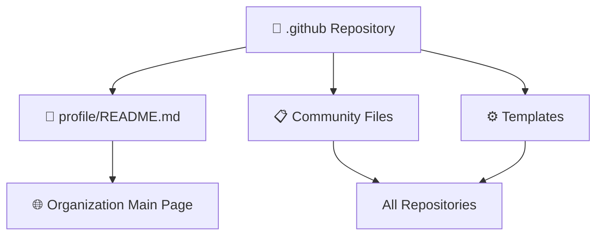
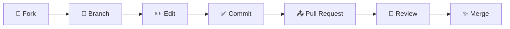

<div align="center">

<!-- Header Banner -->


# 📂 .github Repository

### 🏢 **Documentation and Configuration of Cátedra MANEDS Organization**

<br>

[](https://github.com/Catedra-MANEDS)
[](https://github.com/orgs/Catedra-MANEDS/repositories)
[](./profile/README.md)

<br>

### 💡 *Central configuration and community health files for the entire organization*

---

</div>

## 📋 Table of Contents

- [🎯 About This Repository](#-about-this-repository)
- [👥 Organization Profile](#-organization-profile)
- [📁 Repository Structure](#-repository-structure)
- [🔧 Community Health Files](#-community-health-files)
- [🤝 Contributing](#-contributing)
- [📖 Additional Resources](#-additional-resources)

## 🎯 About This Repository

This is the special `.github` repository for the **Cátedra MANEDS** organization. GitHub automatically uses this repository for:

<table>
<tr>
<td width="33%" align="center">

<br><strong>Organization Profile</strong>
<br><sub>Display profile information on the organization's main page</sub>
</td>
<td width="33%" align="center">

<br><strong>Community Files</strong>
<br><sub>Store default community health files (CODE_OF_CONDUCT, CONTRIBUTING, etc.)</sub>
</td>
<td width="33%" align="center">

<br><strong>Settings</strong>
<br><sub>Configure default repository settings and templates</sub>
</td>
</tr>
</table>

### ✨ Key Features

- 🏠 **Public Profile**: README visible on the organization's main page
- 📄 **Default Templates**: Shared Issues and Pull Requests templates
- 🔒 **Security Policies**: Security guidelines for all repositories
- 🤝 **Contribution Guidelines**: Unified standards for contributors
- ⚙️ **GitHub Actions Workflows**: Shared automations

## 👥 Organization Profile

<div align="center">



</div>

The organization profile README is located in [`profile/README.md`](./profile/README.md) and is displayed on the organization's main page. It contains:

<table>
<tr>
<td width="50%">

### 📖 **Profile Content:**
- ✨ Introduction and mission of the organization
- 🏷️ Repository naming conventions
- 📊 Focus areas and technologies
- 🤝 General considerations for contributors
- 🔗 Links to important resources
- 📚 Best practices guides

</td>
<td width="50%">

### 🎨 **Visual Elements:**
- 🎨 Animated banner
- 🏷️ Informative badges
- 📊 Organized tables
- 🔄 Mermaid diagrams
- 🎯 Descriptive icons and emojis
- 🌈 Professional formatting

</td>
</tr>
</table>

## 📁 Repository Structure

```
📦 .github/
│
├── 📄 README.md              # This file - Repository documentation
│
└── 📂 profile/
    └── 📄 README.md          # Organization profile (publicly visible on GitHub)
```

## 🤝 Contributing

This repository contains important documentation and standards for the entire organization. If you wish to suggest improvements:

<div align="center">

### 🔄 Contribution Flow



</div>

### 📝 Detailed Steps:

1. **🍴 Fork this repository**
   ```bash
   # Make a fork from the GitHub interface
   ```

2. **🌿 Create a feature branch**
   ```bash
   git checkout -b improvement/change-description
   ```

3. **✏️ Make your changes**
   - Edit the necessary files
   - Maintain existing style and format
   - Ensure content is in English

4. **✅ Commit with clear message**
   ```bash
   git commit -m "Clear description of the change"
   ```

5. **📤 Submit a Pull Request**
   - Provide a clear description
   - Explain the purpose of the changes
   - Reference related issues if applicable

### 🎯 Contribution Guidelines:

<table>
<tr>
<td width="50%">

#### ✅ **Do:**
- Maintain consistent Markdown formatting
- Use emojis appropriately and consistently
- Verify that links work
- Update the table of contents if necessary
- Follow existing style conventions
- Provide clear examples when relevant

</td>
<td width="50%">

#### ❌ **Avoid:**
- Format changes without purpose
- Broken or incorrect links
- Content in other languages (except technical terms)
- Removing important information without justification
- Changes that affect readability
- Excessive or inappropriate use of emojis

</td>
</tr>
</table>

## 📖 Additional Resources

<div align="center">

| Resource | Description | Link |
|:-------:|:------------|:------:|
| 🏢 | **Organization Page** | [](https://github.com/Catedra-MANEDS) |
| 📦 | **All Repositories** | [](https://github.com/orgs/Catedra-MANEDS/repositories) |
| 📄 | **Public Profile** | [](./profile/README.md) |
| 📘 | **Markdown Guide** | [](https://docs.github.com/en/get-started/writing-on-github) |

</div>

---

<div align="center">


**[Cátedra MANEDS](https://github.com/Catedra-MANEDS)** - Advanced Network Engineering and Digital Services

*Configuring excellence, one repository at a time* 🚀

<sub>Last update: 2026 | Maintained by the Cátedra MANEDS community</sub>

</div>
