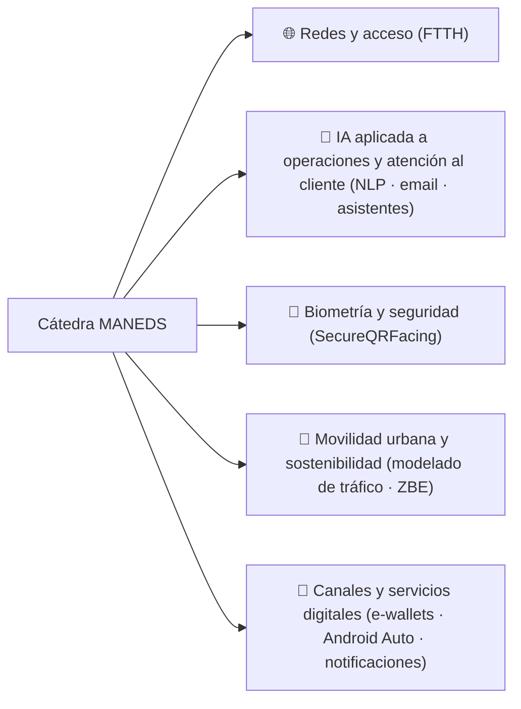

<!-- Header Banner -->

# 🎓 Cátedra MANEDS

### 🌐 **Cátedra MásOrange for Applied-AI Network Engineering and Digital Services**

 

 

### 💡 *Impulsando el futuro de la ingeniería a través de la educación, investigación e innovación*

---

## 👋 ¡Bienvenido a la Cátedra MANEDS!

**¡Bienvenido a la Cátedra MANEDS!**  
Somos una cátedra dinámica dedicada a impulsar el conocimiento y las habilidades en **Inteligencia Artifical** y **servicios digitales** a través de proyectos colaborativos, investigación de vanguardia e iniciativas educativas innovadoras.

 

## 📚 Sobre la Cátedra

**Cátedra MANEDS (MásOrange – Universidad de Alcalá)** impulsa proyectos de **investigación aplicada** y **formación** en torno a la **ingeniería de redes** y los **servicios digitales**, conectando retos reales de la industria con el trabajo académico (TFG/TFM, becas, prototipos y publicaciones).

Nuestro trabajo se articula, principalmente, en estas líneas:

| | |
|---|---|
| 🔬 **Proyectos y líneas de investigación** | Propuesta y desarrollo de proyectos vinculados a retos reales (p. ej., IA aplicada a operaciones y atención al cliente, redes de acceso, biometría, movilidad urbana y canales digitales). |
| 🎓 **Formación y tutorización (TFG/TFM / becas)** | Incorporación de estudiantes a proyectos con acompañamiento y aprendizaje práctico. |
| 🤝 **Colaboración universidad-empresa** | Trabajo coordinado entre la UAH y el equipo profesional de la empresa, con enfoque aplicado y orientación a resultados. |
| 📣 **Difusión y transferencia** | Publicación de avances, resultados y materiales (web, documentación y repositorios cuando procede). |

 

## 🎯 Áreas de trabajo

| 🌐 Redes | 🤖 IA aplicada | 🧬 Biometría / Seguridad | 📡 Servicios digitales |
|:---:|:---:|:---:|:---:|
| Redes de acceso (p. ej., FTTH) | Robots conversacionales (NLP) | SecureQRFacing | Canales digitales (e-wallets) |
| Ingeniería de red y datos | Automatización de canales (email, atención) | Identidad/biometría | Android Auto / notificaciones |
| Observación y medición | Soporte a operaciones | Protección y robustez | Comunicación cliente-servicio |

 

## 📊 Estadísticas de la Organización

---

**Construido con ❤️ por la Cátedra MANEDS**

### 🌟 ¡Únete a nosotros en esta emocionante aventura tecnológica! 🌟

© 2026 Cátedra MANEDS - MásOrange | Todos los derechos reservados

