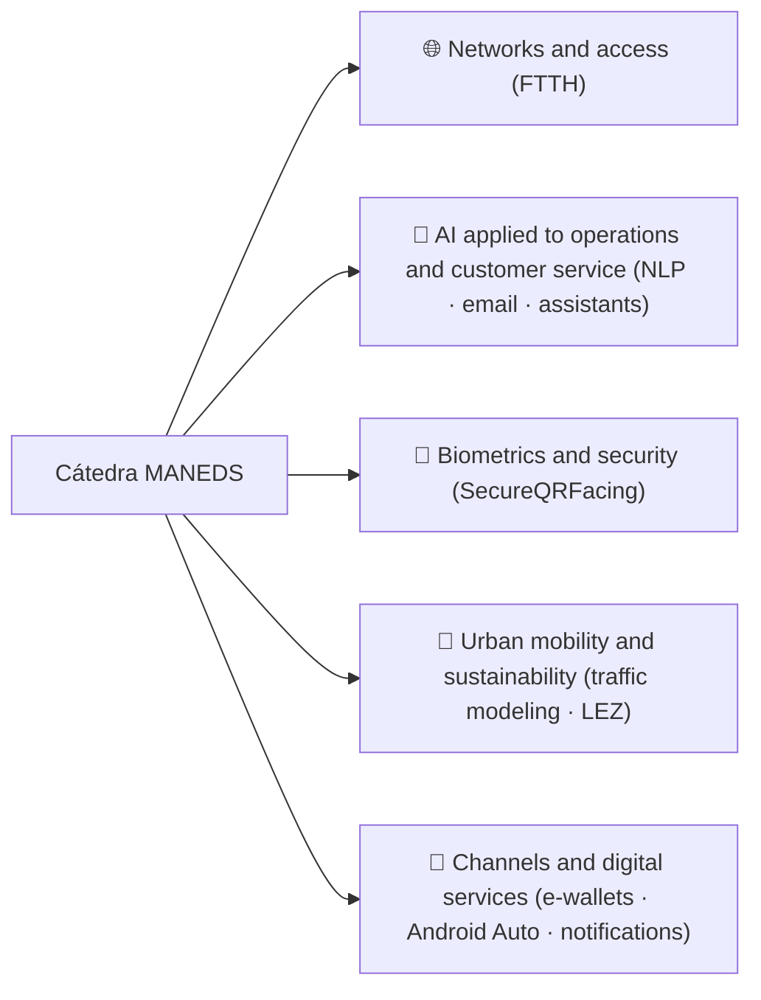

<!-- Header Banner -->

# 🎓 Cátedra MANEDS

### 🌐 **Cátedra MásOrange for Applied-AI Network Engineering and Digital Services**

 

 

### 💡 *Driving the future of engineering through education, research and innovation*

---

## 👋 Welcome to Cátedra MANEDS!

**Welcome to Cátedra MANEDS!**  
We are a dynamic chair dedicated to advancing knowledge and skills in **Artificial Intelligence** and **digital services** through collaborative projects, cutting-edge research, and innovative educational initiatives.

 

## 📚 About the Chair

**Cátedra MANEDS (MásOrange – University of Alcalá)** promotes **applied research** and **training** projects around **network engineering** and **digital services**, connecting real industry challenges with academic work (Bachelor's/Master's theses, scholarships, prototypes and publications).

Our work is primarily organized into these lines:

| | |
|---|---|
| 🔬 **Research projects and lines** | Proposal and development of projects linked to real challenges (e.g., AI applied to operations and customer service, access networks, biometrics, urban mobility and digital channels). |
| 🎓 **Training and tutoring (Bachelor's/Master's theses / scholarships)** | Student incorporation into projects with accompaniment and practical learning. |
| 🤝 **University-industry collaboration** | Coordinated work between UAH and the company's professional team, with applied approach and results orientation. |
| 📣 **Dissemination and transfer** | Publication of advances, results and materials (website, documentation and repositories when applicable). |

 

## 🎯 Work Areas

| 🌐 Networks | 🤖 Applied AI | 🧬 Biometrics / Security | 📡 Digital Services |
|:---:|:---:|:---:|:---:|
| Access networks (e.g., FTTH) | Conversational robots (NLP) | SecureQRFacing | Digital channels (e-wallets) |
| Network and data engineering | Channel automation (email, support) | Identity/biometrics | Android Auto / notifications |
| Observation and measurement | Operations support | Protection and robustness | Client-service communication |

 

## 📊 Organization Statistics

---

**Built with ❤️ by Cátedra MANEDS**

### 🌟 Join us on this exciting technological adventure! 🌟

© 2026 Cátedra MANEDS - MásOrange | All rights reserved

