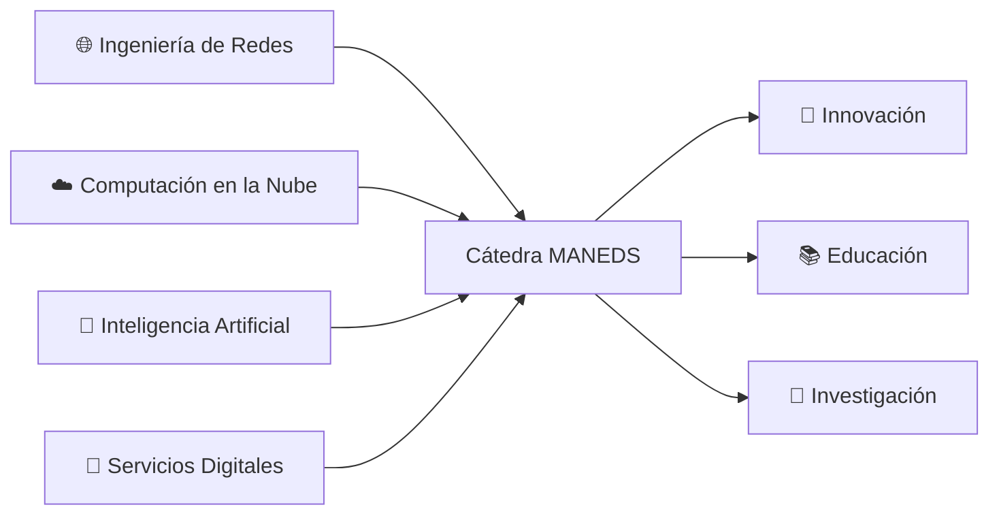

<div align="center">

<!-- Header Banner -->


# 🎓 Cátedra MANEDS

### 🌐 **Cátedra MásOrange for Applied-AI Network Engineering and Digital Services**

<br>

[](https://github.com/Catedra-MANEDS)
[](https://github.com/orgs/Catedra-MANEDS/repositories)
[](https://opensource.org/)

<br>

### 💡 *Impulsando el futuro de la ingeniería a través de la educación, investigación e innovación*

---

</div>

## 👋 ¡Bienvenido a Cátedra MANEDS!

<div align="center">

**¡Bienvenido a la Cátedra MANEDS!**  
Somos una cátedra dinámica dedicada a impulsar el conocimiento y las habilidades en **Inteligencia Artifical** y **servicios digitales** a través de proyectos colaborativos, investigación de vanguardia e iniciativas educativas innovadoras.

</div>

<br>

## 📚 Sobre Nosotros

**Cátedra MANEDS** es una alianza académico-empresarial que une la brecha entre el conocimiento teórico y la innovación práctica. Nuestra misión es dar forma al futuro de las redes y servicios digitales mediante:

<table>
<tr>
<td width="25%" align="center">

<br><strong>Investigación e Innovación</strong>
<br><sub>Explorando tecnologías de vanguardia en redes, computación en la nube, SDN, NFV, 5G/6G y servicios digitales</sub>
</td>
<td width="25%" align="center">

<br><strong>Educación</strong>
<br><sub>Proporcionando oportunidades de aprendizaje práctico a través de proyectos, talleres y programas de mentoría</sub>
</td>
<td width="25%" align="center">

<br><strong>Colaboración</strong>
<br><sub>Fomentando alianzas estratégicas entre la academia y líderes de la industria en telecomunicaciones</sub>
</td>
<td width="25%" align="center">

<br><strong>Código Abierto</strong>
<br><sub>Contribuyendo y manteniendo proyectos de código abierto que benefician a la comunidad tecnológica global</sub>
</td>
</tr>
</table>

<br>

## 🎯 Nuestras Áreas de Enfoque



<div align="center">

| 🌐 **Redes** | ☁️ **Cloud & Virtualización** | 🔐 **Seguridad** | 📡 **Servicios Digitales** |
|:---:|:---:|:---:|:---:|
| SDN/NFV | Kubernetes | Zero Trust | Diseño de APIs |
| 5G/6G | Microservicios | Seguridad de Redes | DevOps |
| IoT | Cloud Native | Gestión de Identidad | CI/CD |
| Enrutamiento/Conmutación | Contenedorización | Detección de Amenazas | Monitorización |

</div>

## 📋 Estándares de Repositorios y Mejores Prácticas

### 🏷️ Convención de Nombres de Repositorios

Mantenemos una convención de nombres **estructurada y consistente** para garantizar claridad y organización en todos los proyectos:

#### **📌 Nombres de Repositorios y Grupos**

<div align="center">

| ✅ **Formato Correcto** | ❌ **Formato Incorrecto** |
|:---|:---|
| `example-repository-name` | `ExampleRepositoryName` |
| `network-tools` | `example_repository_name` |
| `data-analysis-project` | `dataAnalysisProject` |

</div>

**Todos los nombres de repositorios y grupos deben usar el formato kebab-case:**
- Palabras en minúsculas
- Separadas por guiones (`-`)
- Descriptivos y concisos

#### **🔗 Nombres Completos de Repositorios**

Un nombre completo de repositorio indica tanto el **grupo** como el **repositorio**, separados por un guión bajo:

<div align="center">

**Formato:** `nombre-grupo_nombre-repo`

</div>

**📖 Ejemplo de Estructura:**

Nombres de repositorios como:
```
primer-grupo_primer-repo
primer-grupo_segundo-repo
segundo-grupo_primer-repo
```

Representan esta organización lógica:

```
📁 Organización Cátedra MANEDS
├── 📂 primer-grupo/
│   ├── 📄 primer-repo
│   └── 📄 segundo-repo
└── 📂 segundo-grupo/
    └── 📄 primer-repo
```

#### **💡 Beneficios de Esta Convención:**

<table>
<tr>
<td width="33%" align="center">
🔍<br><strong>Fácil Identificación</strong><br><sub>Identifica rápidamente a qué grupo pertenece un repositorio</sub>
</td>
<td width="33%" align="center">
📊<br><strong>Organización Lógica</strong><br><sub>Agrupa repositorios por proyecto, tema o equipo</sub>
</td>
<td width="33%" align="center">
🔗<br><strong>Relaciones Claras</strong><br><sub>Comprende las conexiones entre repositorios relacionados</sub>
</td>
</tr>
</table>

## 📞 Contacto y Recursos

<div align="center">

### 🔗 Enlaces Importantes

[](https://github.com/Catedra-MANEDS)
[](https://github.com/orgs/Catedra-MANEDS/repositories)
[](https://github.com/Catedra-MANEDS/.github)

</div>

<br>

## 📊 Estadísticas de la Organización

<div align="center">

[](https://github.com/orgs/Catedra-MANEDS/repositories)

</div>

---

<div align="center">


**Construido con ❤️ por la Cátedra MANEDS**

*Empoderando a la próxima generación de ingenieros*

### 🌟 ¡Únete a nosotros en esta emocionante aventura tecnológica! 🌟

<sub>© 2026 Cátedra MANEDS - MásMóvil | Todos los derechos reservados</sub>

</div>
